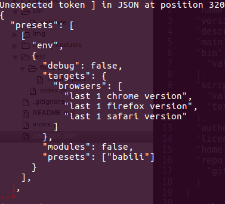

validjson
=========
[](https://travis-ci.org/dotnetCarpenter/validate-json)
[](https://ci.appveyor.com/project/dotnetCarpenter/validate-json/)


Simpel command line JSON validator with an API, in nodejs >=7.0.0.

Tested to work in Windows PowerShell and *nix bash terminal.


### Installation ###

```
npm i -g valid-json-cli
```


### Usage ###

```
Usage:  validjson path [options]
        cat file.json | validjson [options]
        validjson [options] < file.json

Options:
      -s, --silent     no text output - will still exit with exitcode 0 or 1
  -V, -v, --version    display version number and exit
      -h, --help       display this help and exit
```

Currently the only option which does something is `--silent`, which supresses error hint
on error. It does not matter if you set the option before or after the path if you
supply a file as parameter. Unknown parameters are ignored.

The difference between `validjson file.json` and `validjson < file.json` is that
in the former, nodejs fs is reading the file and
in the latter, your terminal (e.i. bash etc) is reading the file and streaming it to validjson.





### API ###

`validjson({String} json, {Boolean} [silent]) : {Boolean} valid`

+ json - the input you want to validate as JSON
+ silent - an optional option to silent validjson on error - defaults to false


```js
"use strict"
// API: validjson({String} json, {Boolean} [silent]) : {Boolean} valid
const validjson = require("valid-json-cli")
const http = require("http")
const request = http.request({ hostname: "jsonip.com" }, response => {
    let json = ""
    response.setEncoding("utf8");
    response.on("data", (chunk) => {
        json += chunk
    })
    response.on("end", () => {
        console.log(`JSON data is ${validjson(json, true) ? "valid" : "invalid"}`)
        console.log(json)
    })
})

request.end()
```
Live example: https://runkit.com/585114841ca9e00014bc0cb4/585114841ca9e00014bc0cb5

### Installation and usage within a project ###

```
npm i --save valid-json-cli
yarn add valid-json-cli
```
_npm and yarn example_

In your `package.json` you can add:

```json
"scripts": {
    "validjson": "validjson",
    "json": "validjson < file.json && echo Good to go!"
},
```

Now you can use it via `npm run validjson` from outside npm e.i. Make.

```make
file.js : file1.json
    npm run validjson -- --silent $<
    # do something more
```
_Make example_

### License ###

The MIT License (MIT)

Copyright © 2016 Jon Ege Ronnenberg
